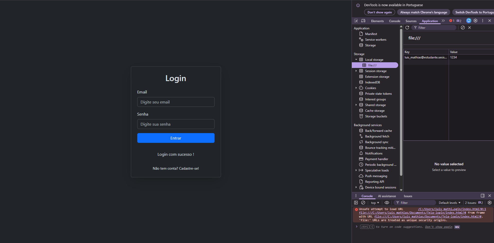

# Tela-login

Feito por Luis Pedro dos Passos Mathias.

Esta atividade se consiste em desenvlver e estilizar uma página de login, com o uso do framework Bootstrap.

Usado para a estilização da página de login, com os requisitos do login feito em JavaScript e HTML.

